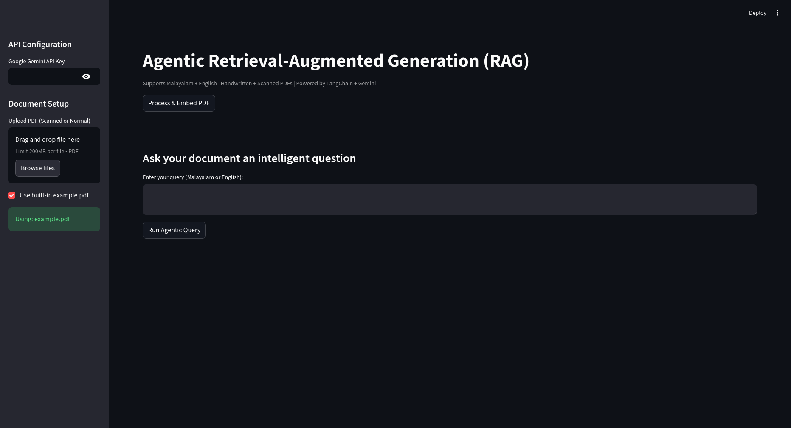

# Agentic RAG PDF Chatbot (LangChain, Gemini & Streamlit)

demo :




This repository contains the code for a Streamlit web application that implements an **Agentic Retrieval-Augmented Generation (RAG)** system.

This chatbot allows you to "talk" to your PDF documents. It's powered by a LangChain agent that uses Google's **Gemini** model. The agent intelligently decides when to retrieve relevant information from the document using a vector store (**ChromaDB**) before answering a user's query.

A key feature of this application is its robust PDF processing, which combines `pdfplumber` for text-based PDFs and `pytesseract` (OCR) for scanned or image-based PDFs, including support for **English and Malayalam** text.

## Key Features

  * **Agentic RAG:** Uses a LangChain `ZERO_SHOT_REACT_DESCRIPTION` agent, which "reasons" about the user's query and decides when to use its `Document Retriever` tool.
  * **Hybrid PDF Processing:**
      * Extracts text directly from digital PDFs using `pdfplumber`.
      * Automatically falls back to Optical Character Recognition (OCR) using `pytesseract` for scanned pages, handwritten notes, or image-based PDFs.
  * **Multi-Lingual Support:** Configured for both **English** and **Malayalam** (`lang="eng+mal"`) for OCR and uses a multilingual embedding model (`paraphrase-multilingual-MiniLM-L12-v2`).
  * **Modern LLM & Embeddings:** Powered by Google's `gemini-2.0-flash-exp` model via `langchain-google-genai` and `SentenceTransformer` embeddings.
  * **Vector Storage:** Uses **ChromaDB** to create a persistent local vector store for efficient document retrieval.
  * **Interactive UI:** Built with **Streamlit**, it provides a simple interface for file uploads, processing, and chat.
  * **Agent Transparency:** A custom `StreamlitCallbackHandler` displays the agent's "thoughts" and "actions" in real-time, showing *why* it's retrieving certain documents.
  * **Dockerized:** Comes with a `Dockerfile` and `docker-compose.yml` for easy, dependency-free deployment.

## How It Works: The Workflow

1.  **UI & Setup (Streamlit):**

      * The user provides their Google Gemini API Key via the sidebar.
      * The user either uploads a PDF or opts to use the built-in `example.pdf`.

2.  **Processing & Embedding (on "Process & Embed PDF" click):**

      * **Text Extraction (`extract_text_from_pdf`):** The app attempts to read the PDF with `pdfplumber`. If a page yields no text (common in scanned documents), it performs OCR on that page. If `pdfplumber` fails entirely, it converts the whole PDF to images and OCRs every page.
      * **Cleaning (`clean_text`):** Extra whitespace and newlines are removed.
      * **Chunking (`chunk_text`):** The cleaned text is split into smaller, overlapping chunks (700 words with 100-word overlap) to ensure semantic context is preserved.
      * **Embedding & Storage (`create_vectorstore`):**
          * The `SentenceTransformer` model (`paraphrase-multilingual-MiniLM-L12-v2`) converts each text chunk into a vector embedding.
          * These embeddings are stored in a local ChromaDB vector store, which is persisted to the directory specified by `CHROMA_PATH` (`./chroma_agent_db`).
          * The initialized vector store is saved in Streamlit's `st.session_state`.

3.  **Querying & Reasoning (on "Run Agentic Query" click):**

      * **Agent Creation (`create_agent`):**
          * A `ChatGoogleGenerativeAI` LLM (Gemini) is initialized.
          * A **Tool** named "Document Retriever" is defined. This tool's function (`retrieve_docs`) queries the vector store (from `st.session_state`) for the top 3 chunks related to the user's query.
          * The `StreamlitCallbackHandler` is set up to write the agent's internal monologue to a `st.empty` container.
          * The `initialize_agent` function assembles the LLM and the tool into a **ReAct** (Reasoning and Acting) agent.
      * **Execution (`agent.run(query)`):**
          * **Thought:** The agent receives the query (e.g., "What is the policy on leave?"). It thinks, "I need to answer this question. I should first search the document."
          * **Action:** The agent decides to use the "Document Retriever" tool with the query.
          * **Observation:** The tool runs, fetches the top 3 relevant text chunks, and passes them back to the agent as "observation." (These retrieved docs are also displayed in the UI via `st.expander`).
          * **Thought:** The agent receives the context and thinks, "Based on the retrieved context, the policy on leave is...".
          * **Final Answer:** The agent synthesizes the retrieved information and its own knowledge to generate a final, coherent answer, which is then displayed in the app.

-----

## Running with Docker (Recommended)

This is the easiest and recommended way to run the application. It automatically handles all system dependencies (Tesseract, Poppler) and Python packages inside a container.

### Prerequisites

  * [Docker](https://www.docker.com/products/docker-desktop/)
  * [Docker Compose](https://docs.docker.com/compose/install/) (usually included with Docker Desktop)

### Files Needed

Ensure you have the following files in your project directory:

  * `app.py` (the main python script)
  * `Dockerfile` (provided)
  * `docker-compose.yml` (provided)
  * `pyproject.toml` (see "Local Setup" for an example)
  * `uv.lock` (generated by `uv lock`)
  * A `./docs` directory with your `example.pdf`

### How to Run

1.  **Build and Run the Container:**
    Open a terminal in the project's root directory and run:

    ```bash
    docker-compose up -d --build
    ```

    This command builds the Docker image based on the `Dockerfile` and starts the service in detached (`-d`) mode.

2.  **Access the App:**
    Open your browser and navigate to **`http://localhost:8501`**.

3.  **How it Works:**

      * The **`Dockerfile`** installs Python, Poppler, Tesseract (with Malayalam), and `uv`, then installs the Python packages from your `uv.lock` file.
      * The **`docker-compose.yml`** manages the service.
          * It maps port `8501` on your computer to port `8501` in the container.
          * It mounts **volumes**:
              * `./docs:/app/docs`: This links your local `docs` folder to the container, so the app can find `example.pdf`.
              * `./chroma_agent_db:/app/chroma_agent_db`: This links the vector store directory. This is **crucial for persistence**, as it saves your embeddings on your host machine, even if the container is stopped or rebuilt.

4.  **Stop the Application:**
    To stop the container, run:

    ```bash
    docker-compose down
    ```

-----

## 🛠️ Local Setup (Manual)

If you prefer not to use Docker, you can set up the environment manually.

### 1\. Prerequisites: System Dependencies

You must install **Tesseract-OCR** and **Poppler** on your system.

  * **Tesseract OCR:**
    `pytesseract` is a Python wrapper for Google's Tesseract-OCR Engine.

      * **Windows:** Download and run the installer from [tesseract-ocr-github](https://www.google.com/search?q=https://github.com/UB-Mannheim/tesseract/wiki). Add the installation directory (e.g., `C:\Program Files\Tesseract-OCR`) to your `PATH`.
      * **macOS (Homebrew):**
        ```bash
        brew install tesseract
        brew install tesseract-lang # Installs all language packs
        ```
      * **Linux (Debian/Ubuntu):**
        ```bash
        sudo apt-get update
        sudo apt-get install tesseract-ocr
        sudo apt-get install tesseract-ocr-eng
        sudo apt-get install tesseract-ocr-mal # Malayalam pack
        ```

  * **Poppler:**
    `pdf2image` requires the Poppler library.

      * **Windows:** Download [Poppler binaries](https://github.com/oschwartz10612/poppler-windows/releases/) and add the `bin/` folder to your `PATH`.
      * **macOS:** `brew install poppler`
      * **Linux:** `sudo apt-get install poppler-utils`

### 2\. Python Environment & Dependencies

This project uses [**`uv`**](https://www.google.com/search?q=%5Bhttps://github.com/astral-sh/uv%5D\(https://github.com/astral-sh/uv\)) for fast Python package management.

1.  **Install `uv`:**

    ```bash
    # macOS / Linux
    curl -LsSf https://astral.sh/uv/install.sh | sh
    # Windows
    powershell -c "Invoke-RestMethod -Uri https://astral.sh/uv/install.ps1 -OutFile uv-install.ps1; .\uv-install.ps1"
    # Or via pip (if you have it)
    pip install uv
    ```

2.  **Create a Virtual Environment:**

    ```bash
    # Create the venv
    python -m venv venv
    # Activate it
    source venv/bin/activate  # On Windows: venv\Scripts\activate
    ```

3.  **Project Dependencies (`pyproject.toml`):**
    Create a `pyproject.toml` file with your dependencies.

    *Example `pyproject.toml`:*

    ```toml
    [project]
    name = "agentic-rag-gemini"
    version = "0.1.0"
    requires-python = ">=3.11"
    dependencies = [
      "streamlit",
      "langchain",
      "langchain-google-genai",
      "langchain-community",
      "sentence-transformers",
      "chromadb",
      "pdfplumber",
      "pdf2image",
      "pytesseract",
      "Pillow"
    ]
    ```

4.  **Install Dependencies:**
    With your virtual environment activated, run `uv sync` to install the packages defined in `pyproject.toml`.

    ```bash
    uv sync
    ```

    This will also create a `uv.lock` file, which ensures reproducible builds.

### 3\. API Key

You need a **Google Gemini API Key**.

1.  Go to the [Google AI Studio](https://aistudio.google.com/app/apikey).
2.  Create an API key.
3.  You will paste this key into the Streamlit app's sidebar when you run it.

## ▶️ How to Run (Local)

1.  Ensure all system dependencies (Tesseract, Poppler) and Python packages are installed.
2.  Activate your virtual environment (`source venv/bin/activate`).
3.  Open your terminal and navigate to the directory containing `app.py`.
4.  Run the Streamlit app using `uv`:
    ```bash
    uv run streamlit run app.py
    ```
5.  Your browser will automatically open to the app (usually `http://localhost:8501`).
6.  **In the app:**
      * Paste your **Google Gemini API Key** into the sidebar.
      * Upload your PDF or check the "Use built-in example.pdf" box.
      * Click **"Process & Embed PDF"** and wait for it to finish.
      * Type your query in the text area.
      * Click **"Run Agentic Query"** and watch the agent work.

## Code Breakdown

  * `CHROMA_PATH`: Directory to save the persistent Chroma vector store.
  * `HF_EMBEDDING_MODEL`: The multilingual model from Hugging Face used to create embeddings.
  * `GEMINI_MODEL`: The specific Gemini model used for reasoning.
  * `extract_text_from_pdf(pdf_path)`: The robust PDF processor. It tries `pdfplumber.open()` first. Inside, it iterates pages. If `page.extract_text()` returns `None`, it converts that specific page to an image (`page.to_image()`) and runs `pytesseract.image_to_string()` on it with English (`eng`) and Malayalam (`mal`) languages enabled. If the *entire* `pdfplumber.open()` fails (e.g., a locked or pure-image PDF), the `except` block triggers, using `convert_from_path` to turn the *whole* PDF into a list of images, then OCRs each one.
  * `clean_text(text)` & `chunk_text(text, ...)`: Standard preprocessing steps to prepare text for embedding.
  * `create_vectorstore(chunks)`: Initializes `SentenceTransformerEmbeddings` and uses `Chroma.from_texts` to build and persist the vector database.
  * `StreamlitCallbackHandler(BaseCallbackHandler)`: A custom LangChain callback. It intercepts the `on_llm_new_token` event (which fires for each token the agent *thinks*) and appends it to a string, updating the `st.empty` container (`self.container`) in real-time.
  * `create_agent(...)`: This is the heart of the application. It assembles the `ChatGoogleGenerativeAI` LLM, the `Document Retriever` tool, and the `StreamlitCallbackHandler` into a `ZERO_SHOT_REACT_DESCRIPTION` agent.
  * `retrieve_docs(query)`: This helper function is wrapped into a LangChain `Tool`. When the agent calls this tool, it not only gets the documents but also *prints* them to the Streamlit UI using `st.expander` for transparency.
